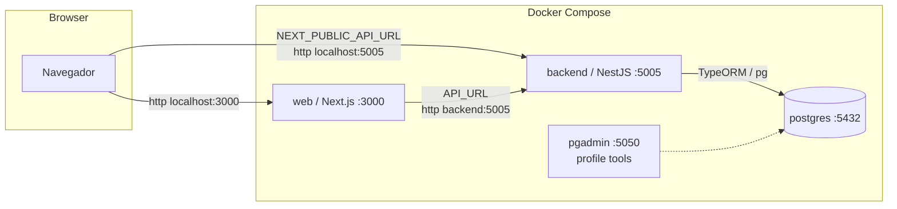
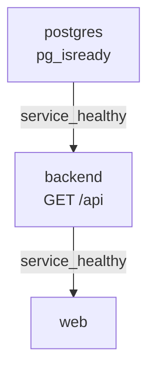

# Arquitetura e Implementação — Docker + Modelo ER no Backend

Documenta o estado do monorepo após a integração do stack Docker (db + backend + web),
o alinhamento das entidades TypeORM ao schema SQL de `database/` e a configuração do Swagger.

- **Fonte da verdade do schema:** scripts SQL em `database/` (`synchronize: false`).
- **Objetivo operacional:** `docker compose up --build` sobe Postgres + backend + web.
- **Documentação relacionada:** [er-model.md](er-model.md) (diagrama ER + mapeamento de colunas).

---

## 1. Visão geral do stack



| Camada | Tecnologia | Porta | Origem |
| --- | --- | --- | --- |
| Frontend | Next.js 15 (standalone) | 3000 | `apps/web` |
| Backend | NestJS 11 + TypeORM | 5005 | `apps/backend` |
| Banco | Postgres 16.2 | 5432 | `database/*.sql` |
| Admin DB | pgAdmin 4 (profile `tools`) | 5050 | imagem oficial |
| Tipos | `@repo/types` | — | `packages/types` |

### Regra de rede (importante)

- **Server-side dentro do container web** usa `API_URL=http://backend:5005` (nome do serviço na rede Docker).
- **Browser** usa `NEXT_PUBLIC_API_URL=http://localhost:5005`.
- `localhost` dentro do container web apontaria para o próprio web — por isso a distinção.

---

## 2. Modelo de dados (SQL como fonte da verdade)

As 8 tabelas de `database/01_schemas.sql` foram mapeadas para entidades TypeORM
mantendo os nomes citados em PascalCase (o Postgres preserva identificadores citados).

Diagrama ER completo e tabela de mapeamento coluna↔propriedade: veja [er-model.md](er-model.md).

### Decisões de mapeamento

| Tema | Decisão |
| --- | --- |
| Nomes de tabela | `@Entity('Usuarios')`, `@Entity('Etapas Processo')` (com espaço) etc. |
| Chaves primárias | `INT` identity chamada `id` (não UUID) |
| Chaves estrangeiras | expostas como `id_*` com `insert:false, update:false`; escrita via relation |
| Binários | `RG`, `foto`, `historico_escolar`, `arquivo`, `arquivo_anexo` → `bytea` (`Buffer`, `select:false`) |
| Decimais | `renda_familiar`, `pontuacao` usam `numericTransformer` (evita string no JSON) |
| Enums | tipos Postgres reutilizados via `enumName` (não recria o tipo) |
| Datas | `DATE` mapeado como `string` (`YYYY-MM-DD`) |

### Enums persistidos

Definidos em `packages/types/src/db-enums.ts` com valores **idênticos** ao SQL:

| Enum TS | Tipo Postgres | Valores |
| --- | --- | --- |
| `StatusCandidatura` | `status_candidatura` | inscricao_recebida, pre_selecionado, analise_documental, aprovado, reprovado |
| `TipoIngresso` | `tipo_ingresso` | sisu, sorteio, ordem_chegada, analise_curricular, transferencia |
| `TipoVagaCandidatura` | `tipo_vaga` | AC, PCD, PII, escola_publica |
| `TipoEtapaProcesso` | `etapa_processo` | periodo_inscricoes … encerrado |
| `ResultadoEtapa` | `resultado_etapa` | aprovado, reprovado, pendente |
| `StatusRecurso` | `status_recurso` | aberto, em_analise, deferido, indeferido |

> O vocabulário de domínio dos editais (miro) fica separado em
> `processo-seletivo-enums.ts` para não colidir com os enums persistidos.

---

## 3. API do backend

Todos os controllers são anotados com `@ApiTags` / `@ApiOperation`; Swagger em `/api`
(inclui exemplos de uso no Next.js e o botão **Authorize** para Bearer JWT).

| Recurso | Método | Rota | Auth | Descrição |
| --- | --- | --- | --- | --- |
| auth | POST | `/auth/login` | público | Autentica e retorna JWT |
| user | POST | `/user` | público | Cadastro (+ endereço opcional) |
| user | GET | `/user` | JWT | Lista usuários com endereços |
| user | GET | `/user/:id` | JWT | Usuário por id |
| user | PATCH/DELETE | `/user/:id` | JWT | Atualiza / remove |
| cursos | GET | `/cursos` | público | Lista cursos |
| cursos | GET | `/cursos/:id` | público | Curso por id |
| cursos | GET | `/cursos/:id/candidaturas` | JWT | Candidaturas do curso |
| cursos | POST/PATCH/DELETE | `/cursos[/:id]` | JWT | CRUD |
| candidaturas | GET | `/candidaturas` | JWT | Lista com usuário + curso |
| candidaturas | GET | `/candidaturas/:id` | JWT | Detalhe com documentos, etapas, recursos |
| candidaturas | POST | `/candidaturas` | JWT | Cria (bloqueia inscrição duplicada) |
| documentos | GET | `/documentos?candidatura=:id` | JWT | Lista / por candidatura |
| documentos | GET | `/documentos/:id` | JWT | Detalhe (sem binário) |
| gestores | GET | `/gestores`, `/gestores/:id` | JWT | Gestor + usuário |
| etapas-processo | GET | `/etapas-processo?candidatura=:id` | público | Lista / por candidatura |
| etapas-processo | GET | `/etapas-processo/:id` | público | Detalhe com candidatura, gestor, recursos |
| recursos | GET | `/recursos?etapa=:id` | JWT | Lista / por etapa |
| recursos | GET | `/recursos/:id` | JWT | Detalhe com etapa e gestor |

### Autenticação

- Guard global `JwtAuthGuard` + decorator `@Public()` nas rotas livres.
- `senha` adicionada por `database/03_auth.sql` (bcrypt) — coluna `select:false`.
- `AuthService.validateUser` compara com bcrypt; `login` assina JWT (`sub = user.id`).
- Header: `Authorization: Bearer <access_token>` (mesmo esquema no Swagger Authorize).
- Next.js: use `API_URL` no server e `NEXT_PUBLIC_API_URL` no browser; exemplos em `/api`.
- Seeds de dev: `joao@teste.com` / `senha123`, `admin@teste.com` / `admin123`.
- `JWT_SECRET_TO_SIGN` e `SECRET_OR_KEY` devem ser iguais no `.env`.

### Regras de negócio já cobertas

- **RS02 — inscrição única:** índice único `(id_usuario, id_curso)` +
  verificação em `CandidaturasService.create` (trata violação `23505`).
- **CPF único / email único:** índices em `03_auth.sql`.

---

## 4. Docker

### Arquivos

| Arquivo | Papel |
| --- | --- |
| `docker-compose.yaml` | Orquestra postgres, backend, web e pgadmin (profile `tools`) |
| `apps/backend/Dockerfile` | Build multi-stage do Nest no contexto do monorepo |
| `apps/web/Dockerfile` | Build multi-stage do Next em modo `standalone` |
| `.dockerignore` | Exclui `node_modules`, `.next`, `.git`, `dist`, docs etc. |
| `.env.sample` | Modelo de variáveis (copiar para `.env`) |

### Healthchecks e dependências



- Postgres: `pg_isready` a cada 5s.
- Backend: `GET /api` (Swagger) como sinal de saúde.
- Web sobe só após backend saudável.

### Variáveis de ambiente

| Variável | Uso |
| --- | --- |
| `DATABASE_HOST` | `postgres` no Docker; `localhost` no host |
| `DATABASE_PORT/USER/PASS/NAME` | conexão TypeORM |
| `PORT` | porta do Nest (5005) |
| `JWT_SECRET_TO_SIGN` / `SECRET_OR_KEY` | assinatura / validação JWT |
| `WEB_ORIGIN` | origem liberada no CORS |
| `API_URL` | base usada pelo web server-side (`http://backend:5005`) |
| `NEXT_PUBLIC_API_URL` | base usada pelo browser (`http://localhost:5005`) |

### Como subir

```bash
cp .env.sample .env
docker compose up --build            # db + backend + web
docker compose --profile tools up    # inclui pgAdmin
docker compose down -v               # reseta o volume (necessário ao mudar SQL)
```

> **Init scripts só rodam em volume vazio.** Ao alterar qualquer arquivo em
> `database/`, rode `docker compose down -v` antes de subir de novo.

> **Ambiente atual:** o `docker` não está disponível nesta distro WSL — ative a
> integração WSL no Docker Desktop para executar a verificação Docker.

---

## 5. Frontend

- `next.config.js`: `output: 'standalone'` (imagem de produção enxuta).
- `apps/web/server/user.ts`: usa `API_URL` / `NEXT_PUBLIC_API_URL` e trata `!response.ok`.
- `apps/web/app/page.tsx`: consome `Usuario` de `@repo/types`, renderiza
  `id` / `nome_completo` (antes usava `User` / `id` / `nome`, inexistentes).
- `apps/web/tsconfig.json`: `moduleResolution: "bundler"` para resolver `@repo/ui`.

---

## 6. Histórico de commits (branch `feat/docker-sql-er-stack`)

| Hash | Commit |
| --- | --- |
| `e7b2348` | feat(db): ✨ add senha column and candidatura uniqueness |
| `704405e` | feat(types): ✨ align shared types with SQL schema |
| `0aa7fcd` | feat(backend): ✨ map TypeORM entities to SQL ER model |
| `ba047c3` | feat(backend): ✨ expose SQL ER through Nest modules |
| `fcfdc5f` | feat(backend): ✨ configure Swagger UI at /api |
| `76e9505` | docs: 📝 add ER mapping and Docker runbook |
| `b3c75c2` | build(docker): 📦 run postgres, backend and web together |
| `f1d8330` | fix(web): 🐛 reach backend via API_URL and Usuario fields |

Push (quando a chave SSH do GitHub estiver disponível):

```bash
git push -u origin feat/docker-sql-er-stack
```

---

## 7. Verificação

| Item | Como | Status |
| --- | --- | --- |
| Build `@repo/types` | `turbo run build --filter=@repo/types` | ✅ |
| Build backend | `turbo run build --filter=backend` | ✅ |
| Build web | `turbo run build --filter=web` | ✅ |
| `docker compose up --build` | requer Docker Desktop WSL | ⏳ pendente (Docker indisponível aqui) |
| `GET /api` (Swagger) | após subir backend | ⏳ |
| `POST /auth/login` (seed) | após subir stack | ⏳ |
| `GET /candidaturas/1` aninhado | após subir stack | ⏳ |
| `localhost:3000` lista usuários | após subir stack | ⏳ |

---

## 8. Rastreabilidade de requisitos (`docs/artefact.txt`)

| Requisito | Coberto agora | Falta |
| --- | --- | --- |
| **RS02** inscrição / CPF único | unicidade `(usuario,curso)`, CPF único, `POST /candidaturas`, enums de status | fluxo PWA, menor de idade/responsável |
| **RS01** gestão / cronograma | `Etapas Processo`, gestores, vagas PPI/PCD | upload edital PDF, termo de aceite, config entrega |
| Fluxo candidato (anexo) | login `senha`, status, documentos/recursos (leitura) | notificações, UX completa |
| Fluxo gestor (anexo) | `tipo_ingresso`, `tipo_vaga`, grafo etapas/recursos | sorteio/SiSU em lote, publicação de resultado |
| **RS03** documentos PPI/PCD | entidade `Documentos` + colunas de arquivo/foto | OCR/CNN, reconhecimento étnico |
| **RS06** cripto em trânsito/repouso | bcrypt nas senhas | TLS, criptografia em repouso |

**Não abordados:** RS04 (chatbot), RS05 (relatórios/lote/lista de espera),
RS07 (human-in-the-loop IA), RS08 (WCAG 2.1).
