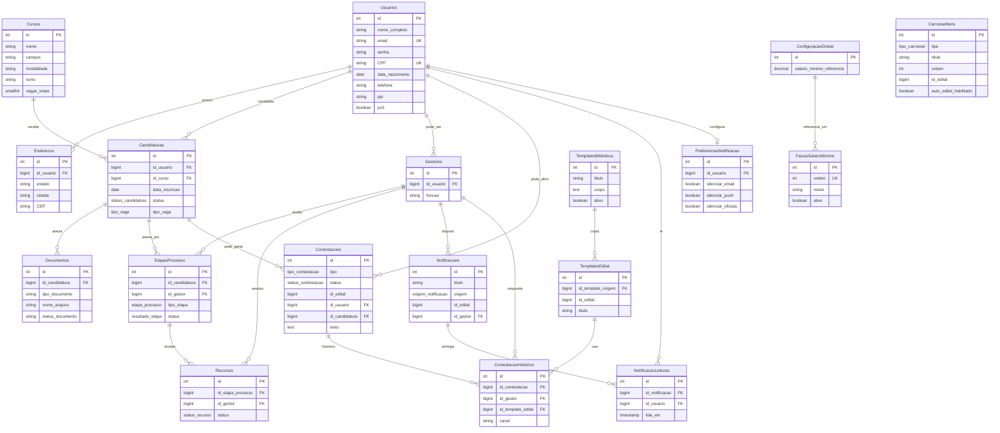

# Modelo relacional (database/)

Fonte da verdade: scripts em `database/` montados em `/docker-entrypoint-initdb.d`.

> Visão geral de arquitetura, API e Docker: [architecture.md](architecture.md).

## W2 extras (`04_schema_extras.sql`)

| Área | Tabelas | Notas |
| --- | --- | --- |
| Contestações (REQ-1.3 / 5.1) | `Contestacoes`, `ContestacaoHistorico` | `tipo` ∈ IMPUGNACAO\|RECURSO\|JUSTIFICATIVA; status `enviada`→`indeferida` |
| Notificações (REQ-6.1) | `Notificacoes`, `NotificacaoLeituras`, `PreferenciasNotificacao` | Audiência via filtros; preferências de silêncio |
| Carrossel (REQ-6.2 / RS09) | `CarrosselItens` | `manual` \| `auto_edital` + toggle `auto_edital_habilitado` |
| Faixas SM (REQ-1.7) | `ConfiguracaoGlobal`, `FaixasSalarioMinimo` | Seed: SM referência; faixas vazias = regra B |
| Templates (REQ-5.2 stub) | `TemplatesBiblioteca`, `TemplatesEdital` | Biblioteca + cópia por edital; APIs em W30 |

`id_edital` columns are **soft references** until W1 creates `Editais` (FK deferred). Legacy `Recursos` remains for the old etapa-bound flow; new contestação UX uses `Contestacoes`.

## Mapeamento coluna SQL ↔ propriedade TypeORM

| Tabela SQL | Coluna | Entity / prop |
| --- | --- | --- |
| Usuarios | id | User.id |
| Usuarios | ppi | User.ppi |
| Usuarios | senha | User.senha (`select: false`) |
| Enderecos | id_usuario | Endereco.id_usuario + relation `usuario` |
| Cursos | nome | Curso.nome |
| Cursos | vagas_cotas_pii | Curso.vagas_cotas_pii |
| Cursos | area_conhecimento | Curso.area_conhecimento |
| Candidaturas | status | Candidatura.status (`status_candidatura`) |
| Candidaturas | tipo_vaga | Candidatura.tipo_vaga (`tipo_vaga`) |
| Etapas Processo | (nome com espaço) | EtapaProcesso `@Entity('Etapas Processo')` |
| Contestacoes | tipo / status | Contestacao (`tipo_contestacao` / `status_contestacao`) |
| CarrosselItens | tipo | CarrosselItem (`tipo_carrossel`) |
| ConfiguracaoGlobal | salario_minimo_referencia | ConfiguracaoGlobal.salario_minimo_referencia |

Enums persistidos: ver `packages/types/src/db-enums.ts` (valores idênticos a `01_schemas.sql` + `04_schema_extras.sql`).

## Auth seed

`03_auth.sql` adiciona `senha` e índices de unicidade.

- `joao@teste.com` / `senha123`
- `admin@teste.com` / `admin123`

## W2 seed

`05_seeds_extras.sql` garante singleton `ConfiguracaoGlobal` (SM referência). Lista de faixas inicia vazia (regra B).

> Init scripts só rodam em volume vazio: use `docker compose down -v` ao mudar SQL.
