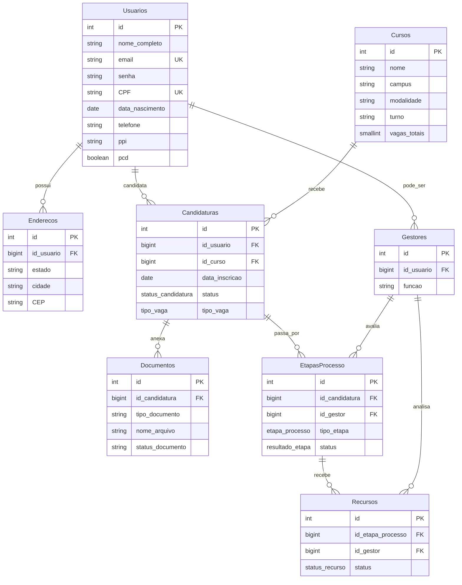

# Modelo relacional (database/)

Fonte da verdade: scripts em `database/` montados em `/docker-entrypoint-initdb.d`.

> Visão geral de arquitetura, API e Docker: [architecture.md](architecture.md).

## Mapeamento coluna SQL ↔ propriedade TypeORM

| Tabela SQL | Coluna | Entity / prop |
| --- | --- | --- |
| Usuarios | id | User.id |
| Usuarios | ppi | User.ppi |
| Usuarios | senha | User.senha (`select: false`) |
| Enderecos | id_usuario | Endereco.id_usuario + relation `usuario` |
| Cursos | nome | Curso.nome |
| Cursos | vagas_cotas_pii | Curso.vagas_cotas_pii |
| Cursos | area_conhecimento | Curso.area_conhecimento |
| Candidaturas | status | Candidatura.status (`status_candidatura`) |
| Candidaturas | tipo_vaga | Candidatura.tipo_vaga (`tipo_vaga`) |
| Etapas Processo | (nome com espaço) | EtapaProcesso `@Entity('Etapas Processo')` |

Enums persistidos: ver `packages/types/src/db-enums.ts` (valores idênticos a `01_schemas.sql`).

## Auth seed

`03_auth.sql` adiciona `senha` e índices de unicidade.

- `joao@teste.com` / `senha123`
- `admin@teste.com` / `admin123`

> Init scripts só rodam em volume vazio: use `docker compose down -v` ao mudar SQL.
