# Modelo relacional (database/)

Fonte da verdade: scripts em `database/` montados em `/docker-entrypoint-initdb.d`.

> Visão geral de arquitetura, API e Docker: [architecture.md](architecture.md).

```mermaid
erDiagram
  Campus ||--o{ Ofertas : hospeda
  Cursos ||--o{ Ofertas : cataloga
  Editais ||--o{ Ofertas : publica
  Editais ||--o{ EditalArquivos : pdf_history
  Ofertas ||--o{ DistribuicaoCotas : divide
  Ofertas ||--o{ Candidaturas : recebe
  Editais ||--o{ Candidaturas : denormaliza
  Usuarios ||--o{ Candidaturas : candidata
  Usuarios ||--o{ Enderecos : possui
  Usuarios ||--o{ Gestores : pode_ser
  Usuarios ||--o{ Contestacoes : pode_abrir
  Usuarios ||--o{ NotificacaoLeituras : le
  Usuarios ||--o| PreferenciasNotificacao : configura
  Candidaturas ||--o{ Documentos : anexa
  Candidaturas ||--o{ EtapasProcesso : passa_por
  Candidaturas ||--o{ Contestacoes : pode_gerar
  Gestores ||--o{ EtapasProcesso : avalia
  Gestores ||--o{ Recursos : analisa
  Gestores ||--o{ Notificacoes : dispara
  Gestores ||--o{ ContestacaoHistorico : responde
  EtapasProcesso ||--o{ Recursos : recebe
  Contestacoes ||--o{ ContestacaoHistorico : historico
  Notificacoes ||--o{ NotificacaoLeituras : entrega
  TemplatesBiblioteca ||--o{ TemplatesEdital : copia
  TemplatesEdital ||--o{ ContestacaoHistorico : usa
  Editais ||--o{ Contestacoes : contexto
  Editais ||--o{ Notificacoes : audiencia
  Editais ||--o{ CarrosselItens : auto_card
  Editais ||--o{ TemplatesEdital : copia
  Editais ||--o{ CronogramaEtapas : agenda
  Editais ||--o{ TiposDocumento : exige
  TiposDocumentoBase ||--o{ TiposDocumento : herda
  TiposDocumento ||--o{ TipoDocumentoCampos : builder
  TiposDocumentoBase ||--o{ DocumentosConta : meus_dados
  Usuarios ||--o{ DocumentosConta : anexa_conta
  Editais ||--o{ ConfiguracaoEntregaDocumental : entrega
  Campus ||--o{ ConfiguracaoEntregaDocumental : local
  Cursos ||--o{ ConfiguracaoEntregaDocumental : curso
  CronogramaEtapas ||--o{ ConfiguracaoEntregaDocumental : etapa
  ConfiguracaoGlobal ||--o{ FaixasSalarioMinimo : referencia_sm
  TemplatesEdital ||--o{ CronogramaEtapas : instrucao_opcional

  Campus {
    int id PK
    string nome UK
  }

  Editais {
    int id PK
    string numero_ano
    metodo_selecao metodo_selecao
    merito_tipo merito_tipo
    bool is_simplificado
    bool fallback_ac_para_rv
    termos_modo termos_modo
    string termos_valor
    string link_oficial
    bool publicado
    bool inscricoes_abertas
  }

  EditalArquivos {
    int id PK
    bigint id_edital FK
    bytea arquivo
    timestamp criado_em
  }

  Cursos {
    int id PK
    string nome
    string eixo_tecnologico
    string requisito_escolaridade
    string area_conhecimento
  }

  Ofertas {
    int id PK
    bigint id_edital FK
    bigint id_curso FK
    bigint id_campus FK
    turno turno
    smallint vagas_totais
  }

  DistribuicaoCotas {
    int id PK
    bigint id_oferta FK
    string tipo_cota
    smallint vagas
    decimal percentual
  }

  Usuarios {
    int id PK
    string nome_completo
    string email UK
    string senha
    string CPF UK
    date data_nascimento
    string telefone
    string ppi
    boolean pcd
  }

  Enderecos {
    int id PK
    bigint id_usuario FK
    string estado
    string cidade
    string CEP
  }

  Candidaturas {
    int id PK
    bigint id_usuario FK
    bigint id_oferta FK
    bigint id_edital FK
    date data_inscricao
    status_candidatura status
    tipo_vaga tipo_vaga
    string protocolo
  }

  Documentos {
    int id PK
    bigint id_candidatura FK
    string tipo_documento
    string nome_arquivo
    string status_documento
  }

  Gestores {
    int id PK
    bigint id_usuario FK
    string funcao
  }

  EtapasProcesso {
    int id PK
    bigint id_candidatura FK
    bigint id_gestor FK
    etapa_processo tipo_etapa
    resultado_etapa status
  }

  Recursos {
    int id PK
    bigint id_etapa_processo FK
    bigint id_gestor FK
    status_recurso status
  }

  Contestacoes {
    int id PK
    tipo_contestacao tipo
    status_contestacao status
    bigint id_edital FK
    bigint id_usuario FK
    bigint id_candidatura FK
    text texto
  }

  ContestacaoHistorico {
    int id PK
    bigint id_contestacao FK
    bigint id_gestor FK
    bigint id_template_edital FK
    string canal
  }

  Notificacoes {
    int id PK
    string titulo
    origem_notificacao origem
    bigint id_edital FK
    bigint id_gestor FK
  }

  NotificacaoLeituras {
    int id PK
    bigint id_notificacao FK
    bigint id_usuario FK
    timestamp lida_em
  }

  PreferenciasNotificacao {
    int id PK
    bigint id_usuario FK
    boolean silenciar_email
    boolean silenciar_push
    boolean silenciar_oficiais
  }

  CarrosselItens {
    int id PK
    tipo_carrossel tipo
    string titulo
    int ordem
    bigint id_edital FK
    boolean auto_edital_habilitado
  }

  ConfiguracaoGlobal {
    int id PK
    decimal salario_minimo_referencia
  }

  FaixasSalarioMinimo {
    int id PK
    int ordem UK
    string rotulo
    boolean ativo
  }

  TemplatesBiblioteca {
    int id PK
    string titulo
    text corpo
    boolean ativo
  }

  TemplatesEdital {
    int id PK
    bigint id_template_origem FK
    bigint id_edital FK
    string titulo
  }

  CronogramaEtapas {
    int id PK
    bigint id_edital FK
    tipo_etapa_cronograma tipo
    string nome_exibido
    timestamp data_inicio
    timestamp data_fim
    int ordem
    etapa_status_override override
    bool elegivel_impugnacao
    bool elegivel_recurso
    bigint template_instrucao_id FK
  }

  TiposDocumento {
    int id PK
    bigint id_edital FK
    bigint id_tipo_base FK
    string nome
    bool obrigatorio
    text[] formatos
    int tamanho_max_bytes
    fase_documento fase
    string tipo_cota
    int ordem
  }

  TiposDocumentoBase {
    int id PK
    string nome
    bool obrigatorio
    text[] formatos
    int tamanho_max_bytes
    fase_documento fase
    int ordem
    bool ativo
  }

  DocumentosConta {
    int id PK
    bigint id_usuario FK
    bigint id_tipo_base FK
    string nome_arquivo
    timestamp atualizado_em
  }

  TipoDocumentoCampos {
    int id PK
    bigint id_tipo_documento FK
    campo_formulario_tipo tipo
    string rotulo
    bool obrigatorio
    int ordem
  }

  ConfiguracaoEntregaDocumental {
    int id PK
    bigint id_edital FK
    bigint id_campus FK
    bigint id_curso FK
    bigint id_cronograma_etapa FK
    modo_entrega modo
    subtipo_entrega_online subtipo_online
  }
```

## W1 foundation (`01_schemas.sql` + `02_seeds.sql` + `03_auth.sql`)

| Área | Tabelas / enums | Notas |
| --- | --- | --- |
| Campus | `Campus` | 12 campi IFB; `nome` UK |
| Edital | `Editais`, `EditalArquivos` | REQ-1.1 / §0.2: `metodo_selecao`, `merito_tipo`, termos (`PDF`/`URL`/`TEXTO`), PDF history (vigente = latest `id`) |
| Catálogo | `Cursos` (slim) | Só `nome`, `eixo_tecnologico`, `requisito_escolaridade`, `area_conhecimento` |
| Oferta | `Ofertas`, `DistribuicaoCotas` | edital × curso × campus × `turno` + `vagas_totais`; cotas `AC`, `PPI`, `PCD`, `ESCOLA_PUBLICA`, `BAIXA_RENDA` |
| Candidatura | `Candidaturas` | FK `id_oferta`; denormalized `id_edital`; partial unique ativa `(id_usuario, id_edital)` WHERE status ∉ cancelada/reprovado/desclassificada; `protocolo` nullable |

Enums W1: `metodo_selecao`, `merito_tipo`, `termos_modo`, `turno`, `tipo_vaga` (PPI not PII), `status_candidatura` (+ `cancelada`, `desclassificada`).

## W2 extras (`04_schema_extras.sql`)

| Área | Tabelas | Notas |
| --- | --- | --- |
| Contestações (REQ-1.3 / 5.1) | `Contestacoes`, `ContestacaoHistorico` | `id_edital` → hard FK `Editais` |
| Notificações (REQ-6.1) | `Notificacoes`, `NotificacaoLeituras`, `PreferenciasNotificacao` | `id_edital` FK |
| Carrossel (REQ-6.2 / RS09) | `CarrosselItens` | `id_edital` FK |
| Faixas SM (REQ-1.7) | `ConfiguracaoGlobal`, `FaixasSalarioMinimo` | Seed: SM referência; faixas vazias = regra B; HTTP `/faixas-sm` (W7) |
| Templates (REQ-5.2 stub) | `TemplatesBiblioteca`, `TemplatesEdital` | `id_edital` FK |

Legacy `Recursos` remains for the old etapa-bound flow; new contestação UX uses `Contestacoes`.

## W5 cronograma (`06_cronograma.sql` + `07_seeds_cronograma.sql`)

| Área | Tabelas / enums | Notas |
| --- | --- | --- |
| Cronograma edital (REQ-1.2) | `CronogramaEtapas` | ≠ `Etapas Processo` (candidatura); catálogo `tipo_etapa_cronograma`; override; soft date overlap in API |
| Elegibilidade (REQ-1.3 flags) | cols on `CronogramaEtapas` | `elegivel_impugnacao`, `elegivel_recurso`, `template_instrucao_id` → `TemplatesEdital` |

Enums W5: `tipo_etapa_cronograma`, `etapa_status_override`.

## W6 doc types + delivery (`08_doc_types_delivery.sql` + `09_seeds_doc_types_delivery.sql`)

| Área | Tabelas / enums | Notas |
| --- | --- | --- |
| Tipos documento (REQ-1.4) | `TiposDocumento`, `TipoDocumentoCampos` | Nome livre; `tipo_cota` NULL = edital-wide; fase `INSCRICAO`/`MATRICULA`; builder `texto`/`numero`/`documento`; template BYTEA opcional |
| Entrega (REQ-1.6) | `ConfiguracaoEntregaDocumental` | UNIQUE(edital, campus, curso, etapa); `PRESENCIAL`\|`ONLINE` + subtipo online |
| Legacy `Documentos` | candidatura files | Sem FK ao catálogo ainda (W26) |

Enums W6: `fase_documento`, `campo_formulario_tipo`, `modo_entrega`, `subtipo_entrega_online`.

## W8 account-base docs (`10_account_base_docs.sql` + `11_seeds_account_base_docs.sql`)

| Área | Tabelas | Notas |
| --- | --- | --- |
| Tipos base da conta (REQ-1.5) | `TiposDocumentoBase` | Globais; herdados em `POST /editais` via `tipos_base_ids` (omit=all, []=none) |
| Vínculo herança | `TiposDocumento.id_tipo_base` | Delete base bloqueado se vinculados; desmarcar = apagar linha do edital |
| Meus Dados ficheiros | `DocumentosConta` | UNIQUE(usuario, tipo_base); um ficheiro atual; HTTP `/me/documentos-conta` |

## Mapeamento coluna SQL ↔ propriedade TypeORM

| Tabela SQL | Coluna | Entity / prop |
| --- | --- | --- |
| Campus | nome | Campus.nome |
| Editais | metodo_selecao / termos_modo | Edital (`metodo_selecao`, `termos_modo`) |
| EditalArquivos | arquivo | EditalArquivo.arquivo (`select: false`) |
| Cursos | eixo_tecnologico | Curso.eixo_tecnologico |
| Ofertas | turno | Oferta.turno (`turno` enum) |
| DistribuicaoCotas | tipo_cota | DistribuicaoCota.tipo_cota (VARCHAR) |
| Candidaturas | id_oferta / id_edital | Candidatura + relations `oferta`, `edital` |
| Candidaturas | protocolo | Candidatura.protocolo |
| Usuarios | senha | User.senha (`select: false`) |
| Etapas Processo | (nome com espaço) | EtapaProcesso `@Entity('Etapas Processo')` |
| CronogramaEtapas | tipo / override / flags | CronogramaEtapa |
| TiposDocumento | fase / formatos / tipo_cota / id_tipo_base | TipoDocumento (`herdado` na API) |
| TiposDocumentoBase | fase / formatos / ativo | TipoDocumentoBase |
| DocumentosConta | id_usuario × id_tipo_base UK | DocumentoConta |
| TipoDocumentoCampos | tipo (texto\|numero\|documento) | TipoDocumentoCampo |
| ConfiguracaoEntregaDocumental | modo / subtipo_online | ConfiguracaoEntregaDocumental |

Enums persistidos: ver `packages/types/src/db-enums.ts` (valores idênticos a `01`–`08` SQL).

## Auth seed

`03_auth.sql` adiciona `senha`, índice parcial de candidatura ativa por edital, e unicidade de email/CPF.

- `joao@teste.com` / `senha123`
- `admin@teste.com` / `admin123`

## W2 seed

`05_seeds_extras.sql` garante singleton `ConfiguracaoGlobal` (SM referência). Lista de faixas inicia vazia (regra B).

> Init scripts só rodam em volume vazio: use `docker compose down -v` ao mudar SQL.
